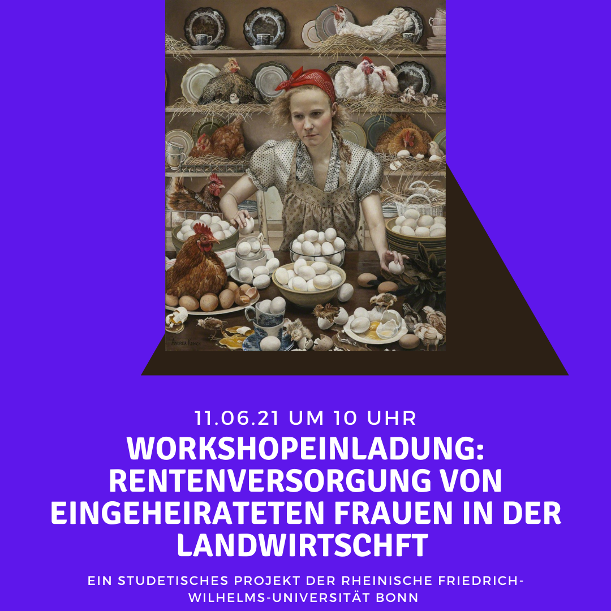
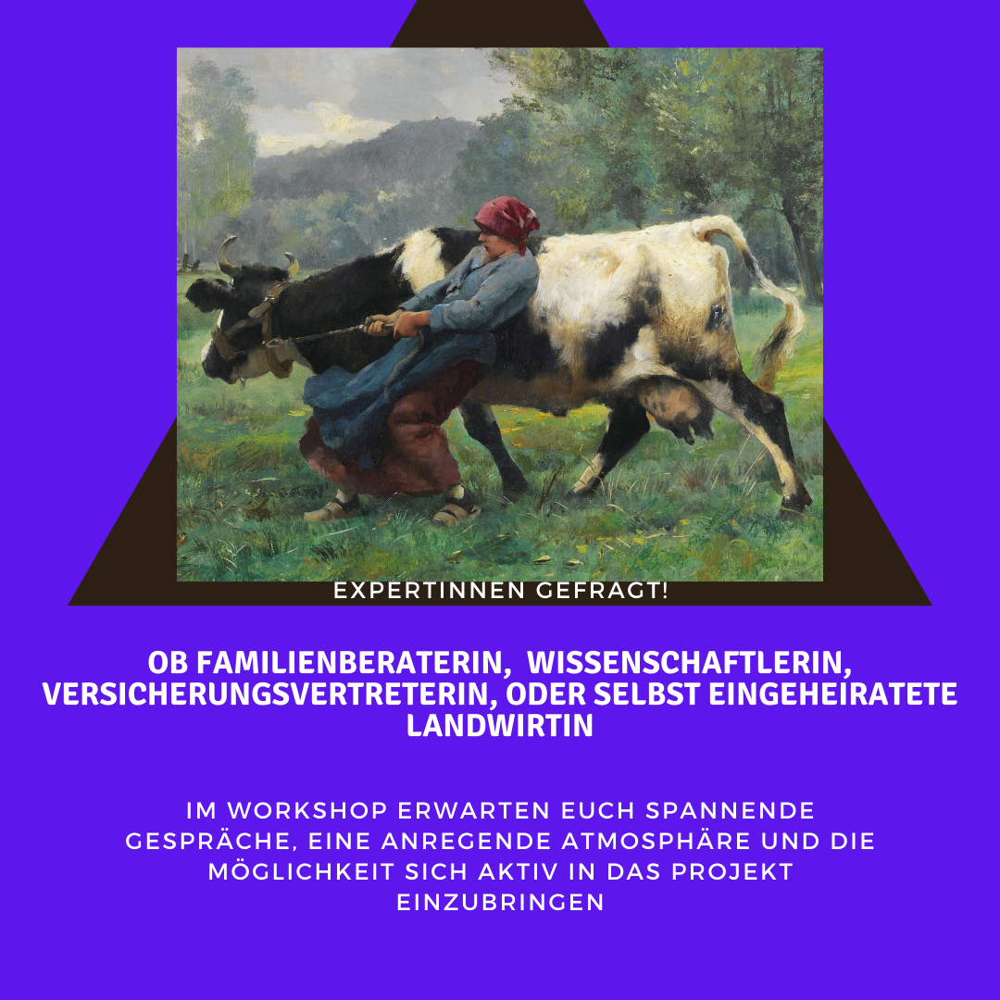
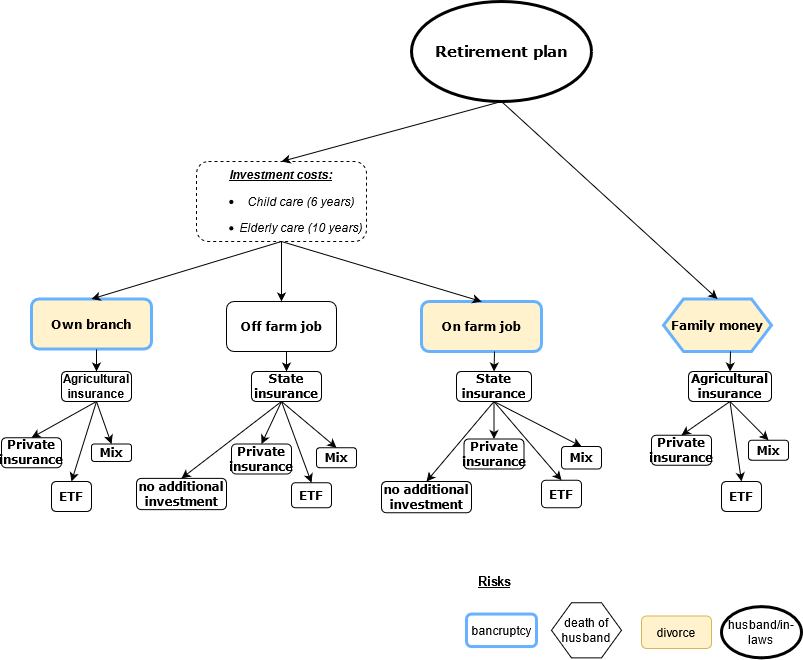
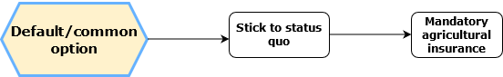

```{r setup, include=FALSE}
knitr::opts_chunk$set(echo = TRUE)
library(knitr)
library(decisionSupport)
library(readr)
library(decisionSupport)
library(DiagrammeR)
library(tidyverse)
library(ggplot2)
library(plyr)
library(dplyr)

```

```{r add_R_bib, include=FALSE}
knitr::write_bib(c(.packages(),
                   'knitr', 'decisionSupport', 'readr', 'DiagrammeR', 'tidyverse', 'ggplot2', 'plyr', 'dplyr'), 'bib/packages.bib')
```
TO DO:

ALINA

- SECTION PROBLEMS/OBSTACLES --> ONLY BULLET POINTS WITH IDEAS UP TO NOW (ALINA)
- FINISH SECTION STAKEHOLDERS (ALINA)
- FIX FIGURE CAPTIONS SO ALL LOOK THE SAME (BOTH TABLES NAMED 4.1.) + MAKE SURE FIGURE NUMBERS IN TEXT ARE CORRECT (ALINA)

ALEXANDRA
- SECTION CODING

SOMEONE
- PROVIDE SOURCE IN LINE 70 (SECTION INTRO) & LINE 182 (AVERGAE FEMALE LIFE EXPECTANCY IN GERMANY IN SECTION MODEL INPUT - https://de.statista.com/statistik/daten/studie/273406/umfrage/entwicklung-der-lebenserwartung-bei-geburt--in-deutschland-nach-geschlecht/) 
- PROVIDE SOURCES THAT LEAD TO FIRST DRAFT OF CONCEPTUAL MODEL --> LANDFRAUENSTUDIE (LINE 122)

NOT YET DONE
- DISCUSSION
- RESULTS
- CONCLUSION
- ABSTRACT


# Abstract
?In our project, we intend to work on gender equality in german farming?.

# Introduction

The ancient role model of the male, patriarch farmer is under deconstruction [@laoire_young_2002]. When looking at agricultural study courses, practical training classes and social media, several scholars perceive a "feminization" of agriculture in Germany [@inhetveen2017feminization] - This perception is reflected in agricultural statistics, stating that women make up more than 36 % of the agricultural workers, 23% of agricultural apprentices and 48% of agricultural students [@BZL2021]. More and more innovative and successful female farmers overcome traditional role models and claim their territory in this formerly male-dominated field [@padel2020arbeiten]. 

Unfortunately, this "feminization" is not reflected in the share of leadership positions and land ownership of women. Today, only 11 % of farm managers are female and only 1/3 of land is owned by females [@destatis2020; @tietz2021untersuchung]. The main reason for this being that women have very little chance of inheriting farm land, as the old-fashioned tradition of male farm succession is still common practice [@Padel2020]. Oftentimes, the only way to gain access to land is either by starting their own farming business or by marrying into an existing one. Unfortunately, most of the latter then take on the role of the farmers wife, a contributing family member or a seasonal worker [@destatis2020]. 
The statistically important group of women who married into farms is expected to do the office-, stable- and housework (e.g.cooking,cleaning), and to take care of the children and elderly. This way they contribute to the family business without adequate financial renumeration or security [SOURCE]. When considering old age and pension, it goes without saying that this arrangement puts her at a considerable disadvantage compared to her husband. This is true for housewives in general, however, it is important to note that the agricultural pension system in Germany is unique as it is loosely based on the idea of traditional family farms.
 
Traditionally, a farmers pension was secured by keeping the family business going by passing it down to his son. However, this system is challenged by structural changes of traditional family farms (e.g.decrease in small farms) [@glauben2009probability]. Currently, the pension of farmers in Germany is usually a combination of agricultural pension insurance, leasing income from property or monthly allowance from successors[@hagedorn1991financing]. Here, the pension payment from the insurance is not intended to cover the living costs but rather simply functions as pocket money [@BMEL2021]. Therefore, revenues of leasing land during retirement is an important supplement to the agricultural pension but legally goes exclusively to the land owner (i.e. the husband in most cases). The fact that farm property rights are unequally distributed in favor of men is also reflected in the farm decision making process- 40% of farmers' wives claim that their husband decides alone on the farm [@Umfrage]. In addition, eventhough farm wives can also be insured by the agricultural insurance, they often receive a lower pension than men for various reasons (e.g. contributing family members pay and receive less pension, fewer years of contibutuin etc.)[@BREG2017]. In short, despite working full-time on the farm, farmers' wives often lack decision making power (in regards to the farm) and are financially depend on their husbands and their in-laws.
 
The imbalance of a high workload on the one hand and a lack of proper financial compensation on the other does not yield an adequate pension. Additionally, divorce or death of the husband constitute major risks for a farm wives' pension. As a result, hard-working women on family farms bear a high risk of old-age poverty if they do not have a proper pension plan. However, acquiring independent pension entitlements is challenging for women on farms. First, their „patchwork employment biographies“ are disadvantageous in the German pension system and often lead to low pension payouts. Second, patriarchal traditions demand child and elderly care from women and this workload often does not allow for noteworthy off-farm employment in the first place. Third, oftentimes farm wives are not fully aware of their situations and/or of alternatives. Breaking out of old traditions has the potential to create new opportunities and financial security and independence, but it also contains risks and uncertainties.
 
In our study, we display different pension options that farm wives have. However, given the high system complexity, the long-term benefits of pension
schemes are difficult to anticipate. This study aimed to integrate uncertainty into long-term performance projections for pension scheme interventions in Germany by applying decision analysis and probabilistic modeling approaches to produce economic ex-ante assessments for pension schemes. With our research we would like to show that risks and uncertainties do not need to be a reason to stick to a status quo that discriminates against females in farming. We would like to encourage female farmers to be courageous and look into their options and not be satisfied with practice as usual.
 
# Decision

When looking at gender equality, the freedom to act of the group that is discriminated against is usually limited and entails a number of risks. That being the case we were particularly interested to investigate the decision making process and options from the woman's point of view. In order to do that we set up a realistic and specific case study.

## Decision maker

Our decision maker is a 25 year old woman. The farm she married into is still owned by her in-laws resulting in her to be registered as a contributing family member for the next five years, until the farm is being transfered to her husband. During that time, the amount of money paid into her agricultural pension and the payout she will reveice in old age are only half of that of her husband's. At the age of 30, her husband will become farm owner and her and her husband's status will be the same in regards to the agricultural pension. It is important to keep in mind that this is not always the case. As we learned in the workshop (see section Participatory research), a large number of farms chose to cancel the woman's agricultural pension because they prefer to invest the money into the farm directly.  
There are a number of additional individual characteristics that affect her options to take precautions for her financial future. We determined her to be a gardener by trade, she did not bring any noteworthy wealth or property into the marriage and the couple already has one young child.
 
## Options

She has two options to chose from.

Decision option 1 aka default option: 
The first option is to stick to the status quo, meaning she follows the traditional structures (i.e. contributing full time to the family business without renumeration) ,and relies on her husband and his farming business to secure her pension. In this case she is officially registered as a farm wife and the mandatory agricultural insurance is paid for her by her husband. 
 
Decision option 2 aka pension plan:
As an alternative option, she pursues a pension plan to ensure financial security once she retires. There is a considerable amount of different pension schemes to chose from along with a number of possible ways to finance her pension independently of her husband (e.g. off-farm employment). Additionally, each option comes with its' own risks.

## Stakeholders 

There are four stakeholders in this decision. EXPLAIN A BIT FURTHER?

### Farmer
BRIEF DESCRIPTION WHY THEY ARE AFFECTED BY THIS DECISION
### Children
BRIEF DESCRIPTION WHY THEY ARE AFFECTED BY THIS DECISION
### Young female farmers
BRIEF DESCRIPTION WHY THEY ARE AFFECTED BY THIS DECISION
### Students with a partner with a farm
BRIEF DESCRIPTION WHY THEY ARE AFFECTED BY THIS DECISION

# Methods
After extensive literature research on female farmers in Germany, we identified the statistically important group of women married into farms and narrowed down the focus on the pension issue for these women in Germany. In order to illustrate possible options and interrelations that help to facilitate a decision making process, we created a first draft of a conceptual model (see Figure 4.1). In the course of this project, we solely focused our attention on the monetary values, excluding any emotional conditions and personal preferences, due to the limited scope and timeframe of this module.
Next, we took the participatory approach and reached out to stakeholders and experts to update our model. We then used the updated version (see Figure 4.3) as a template for our coded model. The model was then created according to @R-decisionSupport. We also made use of the tools by @R-tidyverse. In a final step, this report was compiled using tools from the @R-knitr team.

## Draft of conceptual model

Our inital model draft was based on literature (WEBSITES USED TO GET THIS INFORMATION E.G LANDFRAUENSTUDIE) and personal experiences (Figure 4.1). It displays both decision options that lead to her pension i.e. the decision option 1 aka default option and decision option 2 of choosing a pension plan.
We chose the three most commonly mentioned ways in the literature to secure a safe pension, namely owning property, investing in private insurance and paying into state insurance. 
As ways to finance these pension schemes we decided on four different financing options. Self-emplyoment on the farm (e.g. as a gardener), setting up a co-ownership of the farm with her husband, convincing her in-laws/husband to pay her fully or working in her chosen profession as a gardner off farm. All of these options could be used for investment into property or private insurance. In order to make use of state insurance she would have to be officially employed on the farm, or take on an occupation off farm. 
In a brainstorming session, we collected different risks for each option. If she sticks to status quo (i.e. default option) she is financially dependend on her family-in-law. Events that could highly threaten her pension in this case are a possible divorce, a fatal accident at work of her husband, or bancruptcy of the farm.
Obstacles that we thought likely to make it difficult for her to choose a pension plan is the objection of the husband himself and the need to cover child and eldery care, which is mainly seen as her responsibility. 
 
```{r, echo=FALSE, out.width='100%', fig.align='center', fig.cap='Model draft', fig.show='hold'}
knitr::include_graphics('images/Model_before_workshop.png')
```

## Participatory approach 

In this step, our goal was to gain a better understanding of the actual and current pension situation of farmers wives' in Germany in order to define a realistic case of a decision maker and to update and adjust our initial conceptual model. For this, we first identified advisors in private as well as agricultural insurance companies (i.e social insurance for agriculture,forestry and horticulture SVLFG), the agricultural chamber (i.e. Landwirtschaftskammer Nordrhein-Westfalen), laywers for agricultural family law and the german woman farmers association (i.e. deutscher Landfrauenverband) as our experts. We then conducted several interviews via phone and the video communiactions platform zoom.us. Additionally, we used the social networking sites facebook.com and instagram.com to approach potential decision makers (i.e.farm wives). We then organised an online workshop over zoom with the previously identified experts, stakeholders and potential decision makers (Figure 4.2).

```{r, echo=FALSE, out.width='50%', fig.align='center', fig.cap='Figure 2. Invitation to the Workshop', fig.show='hold'}


```

Table 4.1 shows an overview of the participants, their status in our research, and whether they partook in an interview and/or in the workshop.
In total, 15 participants attended our workshop. After a brief introduction and a general initial discussion, the participants were given three questions, namely "What pension options does a farm wife have?" "What are potential risks and obstacles?" and "How could she finance the pension options?". After answering these questions in groups of three, we collected all thoughts and ideas in plenum. After a lively discussion we were able to update our model.

Table 4.1: Overview of participants, their status and type of contribution (FIX FIGURE CAPTION TO LOOK LIKE OTHERS)

|  Participant 	| Status  	|  Interview 	|  Workshop participation 	|   	|
|---	|---	|---	|---	|---	|
|  Farmer's wife 	|  decision-maker 	|   no	|  yes 	|   	|
|  Farmer 	|  stakeholder and co-decision-maker 	|   no	|  no 	|   	|
|  Farm Children 	|  stakeholder 	|  no 	|  yes 	|   	|
|  Rural woman association 	|  expert 	|  yes 	|  yes 	|   	|
|  Agricultural Insurance agency 	|  expert 	|  yes 	|   yes	|   	|
|  State insurance agency 	|  expert 	|   no	|  no 	|   	|
|  Private insurance consultant 	|  expert 	|  yes 	|   no	|   	|
|  Agriculral chamber consultant 	|  expert 	|  yes 	|   yes	|   	|
|  Lawyer for agricultural family law	|  expert 	|  no 	| yes  	|   	|
|  Young woman farmers	|  stakeholder 	|   no	|  yes 	|   	|
|  Students with a partner with farm 	|  stakeholder 	|   no	| no  	|   	|


## Adjustment of conceptual model

Based on the outcomes of our research we adjusted and specified our decision option 2 (i.e. financing her own retirement plan) in our conceptual model (Figure 4.3).

```{r, echo=FALSE, out.width='100%', fig.align='center', fig.cap='Figure 4. Adjusted decision option 2 pathways of financing her own retirement', fig.show='hold'}

```

As a first step we eliminated the options of farm co-ownership and self- emplyoment we previously considered as a possible financing option. We learned in the workshop that co-ownerships are hardly done in reality as it is not feasible for most farming businesses and self-employment of both parents is hardly manageable when simultaneuosly raising a child.
In the end, we were left with four financing options. Three of which require intial investment costs in form of covering child and elderly care. Establishing an own branch on the farm itself, particuarly in form of setting up a farm shop, delivery service or holiday housing seemed to be popular among workshop participants. Identified risks for this option were the circumstance of divorce and the bancruptcy of the farm.
Getting an off farm job or negotiating with the in-laws to be officially employed at the farm was also mentioned frequently.Here, the risks are related to the farm and therefore identical with the ones for 'own branch on farm' (i.e. risk of divorce, bancruptcy).
Another option we had not thought of before the workshop is to receive money from her husband which she can then invest into a pension plan. Howere, the risks here are equal to the default option as she would also rely on her husband for her pension (i.e. risk of divorce,bancruptcy, death of husband) 
When it comes to pension schemes, we excluded own property and only focused on the investment into different insurances. Here, we explicitly follow the available information on german pension schemes as stated by the pension consultants.
If choosing the options of own branch or receiving family money she would pay into the agricultural insurance by herself, and on top of that has the options to invest into private insurance or ETFS or a mix of both. The other two options of on and off farm job imply the mandatory state insurance, which she then could also boost with additional private insurance, ETFs or a mix.
We would like to highlight that the greatest obstacle to option 2 (i.e. pension plan) we were able identify from the workshop was in fact the husband/in-laws themselves. Every option in the retirement plan itself contains the risk, that they oppose her decision to plan for her retirement. Mainly because they do not see the necessity for it as farmers generally prefer to invest into their farming business rather than into their wives pension schemes. Additionally, the investment costs and having to find suitable child and eldery care is a further deterrent.This risk is illustrated by a black circle in the model and affects every option within the pension plan decision.
The default option and associated risks remained the same in the updated version. The only change was that of design to match the design of the new decision options 2 pathway (Figure 4.4).

```{r, echo=FALSE, out.width='100%', fig.align='center', fig.cap='Figure 4. Decision option 1 aka default option after the workshop', fig.show='hold'}

```

## Model Inputs

The previous determination of our decision maker (see section 3.1 Decision maker) allowed us to fill our input table with values (Table 4.1).
After receiving a calibration training in the DA-Course, we considered ourselves calibrated experts and were able to estimate reasonable ranges based on a mixed approach of literature reasearch and expert opinion.
The time frame of our intervention amounts to 40 years (i.e. retirement at the age of 65). Based on this and according to the Methodology of @do_decision_2020, we tried to assign reasonable uncertainties given this long time horizon.
Based on her appointed profession as gardener, we estimated her possible yearly income and amount of payment into the different insurance options. We repeated this process for own farm branch, on farm job and receiving family money. Hereby, we agreed that she would be able to invest at least 10 % of her income into private insurance schemes (i.e. private insurance, ETFs, or mix of both). After retiring, it is likely that she lives and receives her pension for another 17 years until the age of 82, which is the average female life expectancy in Germany (SOURCE).
Pension estimation calculators such as the brutto-netto-rechner, Allianz-Rechner-Privatrente, SVLFG-Rentenschätzung and etf-sparplanrechner were used to narrow down reasonable monetary amounts of each option within the pension plan option.
The monthly payment into and payout of the agricultural insurance depends on her status (i.e. wife of farm owner or contributing family member). In our case she is a contributing family member for five years, until her husband becomes farm owner. As soon as that happens the contributions into the insurance and her pension increase by 50%. It becomes obvious that a late farm transfer could have a negative impact on her pension. 
The identified risks were then quantified by simulating their likelihood and degree of significance for her pension.

```{r tables, echo=FALSE}
input_table_gender <-read.csv2("./input_table_gender_final_trial_years_woRISK.csv", dec = ",")
knitr::kable(input_table_gender, caption ='Input table')
# [1:5, ]
```

# Coding the model

The model was created in accordance with @R-decisionSupport. 
Since the pension yield and input demand depend on the age of the decision-maker, all benefits and costs were modeled in relation to individual circumstances of the decision maker (e.g. profession,age etc). Since pension payment and payouts are usually paid per month, we first used a monthly time unit in our code. However, doing that created a wide variety of outputs for 684 months (40 years of working and paying into her pension plus 17 years of receiving pension) making it highly complicated to create a straightforward output. Interpreting this was beyond our capabilites, so we decided to use yearly time untis instead as intended by the decisionSupport package.

## Multiple ways

## EVPI

## Cashflow

## Risks


- ADD CODE CHUNKS AND DESCRIPTION (LARS AS EXAMPLE?)
- FULL CODE IN SEPERATE FILE ON GITHUB--> WHERE CORY CAN EASILY FIND IT (AS SUGGESTED BY CORY)


# Results/Outcome

(ong-term payments directed to their woman retirement incur high establishment and maintenance costs and will generate net losses in the first few years but return substantial benefits to the wife and family in the long term.) --> STILL CORRECT?

# Discussion

Right mixture of options is important --> for each individual case--> depends on age, wealth before wedding, profession, in-laws (whether they see the need for a retirement plan) etc. 

Annual profits from farming mostly benefit the farm owner, which is rarely is the women. Farmers likely prefer reinvesting the available money in farming technology due to the relatively early incomes and short time-lag on returns. However, structural changes in agriculture and the high give-up rates impose high insecurity on the future of the farm and may raise the awareness for proper pension plans.
Uncertainties related to the communication culture in farming families, farmers’ values, farm profitability, and pension returns appeared to have the greatest influence on whether a retirement plan emerged as the preferable option. Better access to information and self confidence to ask for a fair share of farming income are prerequisites to implement pension plans for in-married woman in german farms. Narrowing these key knowledge gaps may offer additional clarity on farmers’ wives optimal course of action and provide guidance for agencies promoting insurance interventions in Germany. Our model produced a set of plausible ranges for net present values and highlighted critical variables, more clarity on which would support decision-making under uncertainty. Our research approach proved effective in providing forecasts of uncertain outcomes and can be useful for informing family farms pursuing a pension plan.-->IS THAT TRUE? I THOUGHT OUR MODEL WAS RATHER CONFUSING
 
@do_decision_2020
@fabian2018stellung
@muller2010kostenlosen
@hadler2020
@oedl2020feminist_innen
@BREG2017

## Problems/Obstacles/Uncertainties/what we did not implemement

- There are severalrisks, that would even decrease the value of the default option. 
Risk of no farm transfer: when the farm actually does not belong to the partner, but still to the parents in law, the situation of the woman is very insecure. She will not be registered as a wife. Without marriage, she can not be registered as a contributing family member. 

- Case of no marriage: When the woman is not married but "only" a partner, she will mot be eligible to the agricultural pension.

- Not possible to include all risks --> talked about a variety of other risks not included e.g. losing job (not likely), late farm transfer (influences all other options--> too big for this module

- Not possible to include emotional strains/state (very individual), just financial monetary.

- child care & elderly care was difficult to implemement into the coding--> left it out even though quite important in reality


- not widely applicable --> need specific case study

# Conclusion
# References


