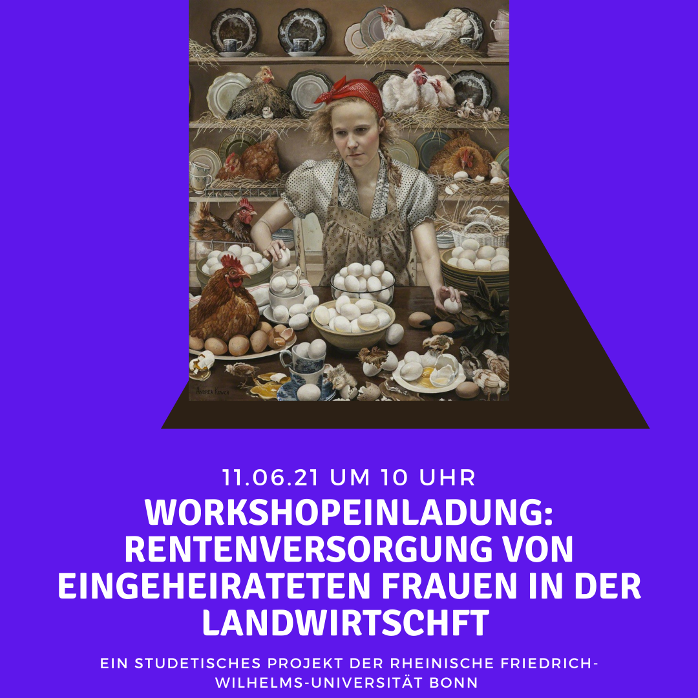
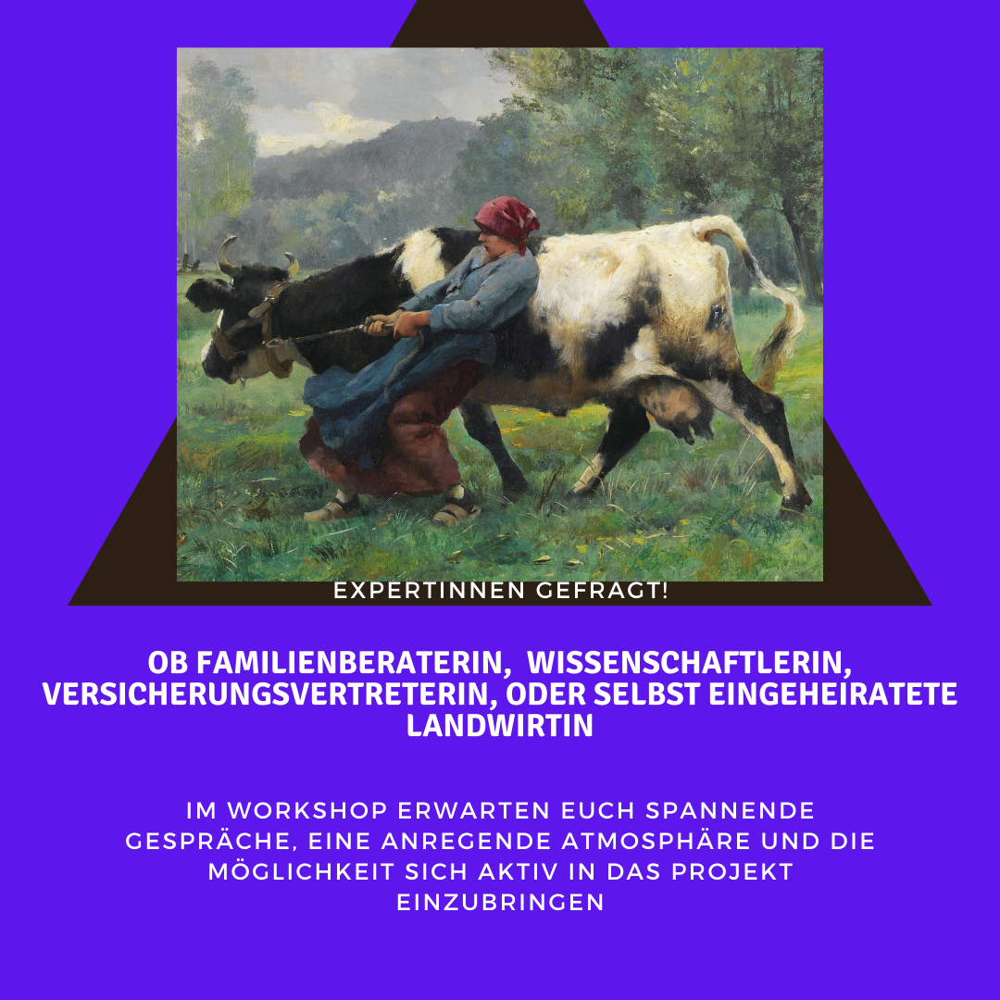

```{r setup, include=FALSE}
knitr::opts_chunk$set(echo = TRUE)
library(knitr)
library(decisionSupport)
library(readr)
library(decisionSupport)
library(DiagrammeR)
library(tidyverse)
library(ggplot2)
library(plyr)
library(dplyr)

```

```{r add_R_bib, include=FALSE}
knitr::write_bib(c(.packages(),
                   'knitr', 'decisionSupport', 'readr', 'DiagrammeR', 'tidyverse', 'ggplot2', 'plyr', 'dplyr'), 'bib/packages.bib')
```

# Introduction

The ancient role model of the male, patriarch farmer is currently being  deconstructed [@laoire_young_2002]. When looking at agricultural study courses, practical training classes, and social media, several scholars perceive a "feminization" of agriculture in Germany [@inhetveen2017feminization]. This perception is reflected in agricultural statistics, stating that women make up more than 36% of the agricultural workers, 23% of agricultural apprentices and 48% of agricultural students [@BZL2021]. More and more innovative and successful female farmers are overcoming the traditional gendered roles and claiming their space in this formerly male-dominated field [@padel2020arbeiten]. 

Unfortunately, this "feminization" is not reflected in the share of leadership positions and land ownership of women. Today, only 11 % of farm managers are female and only 1/3 of land is owned by females [@destatis2020; @tietz2021untersuchung]. The main reason for this is that women have very little chance of inheriting farmland. The old-fashioned tradition of male farm succession is still common practice in Germany [@Padel2020]. Oftentimes, the only ways in which women can gain access to land is if they start their own farming business or marry into an existing one. Unfortunately, most women who follow the latter route then take on the role of the farmer's wife [@destatis2020]. They are expected to do the office-, stable- and housework (e.g.cooking,cleaning), and to take care of the children and elderly. In this way they contribute to the family business without adequate financial remuneration or security  [@inhetveen2017feminization]. When considering old age and pension, it goes without saying that this arrangement puts women at a considerable disadvantage compared to their husbands. This is true for housewives in general, however, it is important to note that the agricultural pension system in Germany is unique as it is loosely based on the idea of traditional family farms.
 
Traditionally, a farmer's pension was secured by keeping the family business going by passing it down to his son. However, this system is challenged by structural changes and decrease of small family farms [@glauben2009probability]. The pension of farmers in Germany is usually a combination of agricultural pension insurance, leasing income from property or monthly allowance from successors [@hagedorn1991financing]. Here, the pension payment from the insurance is not intended to cover the living costs but rather simply functions as pocket money [@BMEL2021]. Therefore, the revenues of leasing land during retirement is an important supplement to the agricultural pension but legally goes exclusively to the land owner (i.e. the husband in most cases).  Even though farm-wives can also be insured by agricultural insurance, they often receive a lower pension than men for various reasons (e.g. contributing family members pay and receive less pension, fewer years of contribution etc.; @BREG2017). The fact that farm property rights are unequally distributed in favor of men is also reflected in the farm decision making process, where 40% of farmers' wives claim that their husband decides alone on the farm [@Umfrage]. In short, despite working full-time on the farm, farmers' wives often lack decision-making power (in regards to the farm) and are financially dependent on their husbands and their in-laws.
 
The imbalance of a high workload on the one hand and a lack of proper financial compensation on the other, does not yield an adequate pension. Additionally, divorce or death of the husband constitute major risks for a farm-wives' pension. As a result, hard-working women on family farms bear a high risk of old-age poverty if they do not have a proper pension plan. However, acquiring independent pension entitlements is challenging for women on farms. First, their "patchwork employment biographies" are disadvantageous in the German pension system and often lead to low pension payouts. Second, patriarchal traditions demand child and elderly care from women and this workload often does not allow for noteworthy off-farm employment in the first place. Third, oftentimes farm-wives are not fully aware of their situations and/or of alternatives. Rational decision-making about pension options, moving beyond outdated traditions, has the potential to create new opportunities and financial security and independence for women, but it also contains risks and uncertainties.
 
In our study, we display different pension options that farm-wives have. However, given the high system complexity, the long-term benefits of pension
schemes are difficult to anticipate. This study aims to integrate uncertainty into long-term performance projections for pension scheme interventions in Germany by applying decision analysis and probabilistic modeling approaches to produce economic ex-ante assessments for pension schemes. With our research, we would like to show that risks and uncertainties do not need to be a reason to stick to a status quo that discriminates against females in farming. We would like to encourage female farmers to be courageous and look into their options and not be satisfied with practice as usual.
 
## Decision

When looking at gender equality, the freedom to act of the group that is discriminated against is usually limited and entails a number of risks. That being the case we were particularly interested to investigate the decision- making process and options from the woman's point of view. To do that we set up a realistic and specific case study. Our decision-maker can either stick to the status quo or decide on an intervention to improve her pension. 

**Option 1 "Default option"**

Here our decision maker follows the traditional structures (i.e. contributing full time to the family business without renumeration), and relies on her husband and his farming business to secure her pension. In this case, she is officially registered as a farm wife and the mandatory agricultural insurance is paid for her by her husband. 
 
**Option 2 "Pension plan intervention"**

In our model, we evaluate 14 different interventions where she pursues a pension plan to ensure financial security once she retires. There is a considerable amount of different pension schemes to chose from along with many possible ways to finance her pension independently of her husband (e.g. off-farm employment).

# Methods

After extensive literature research on female farmers in Germany, we identified the statistically important group of women married into farms and narrowed down the focus on the pension issue for these women in Germany. To illustrate possible options and interrelations that help to facilitate a decision-making process, we created the first draft of a conceptual model (see Fig. \@ref(fig:oldmodeldraft). In the course of this project, we solely focused our attention on the monetary values, excluding any emotional conditions and personal preferences, due to the limited scope and timeframe of this module.
Next, we took the participatory approach and reached out to stakeholders and experts to update our model (see Fig. \@ref(fig:invitation)). We then used the updated version (see Fig. \@ref(fig:draftmodel)) as a guideline for our model code. The model was then created according to @R-decisionSupport. We also made use of the tools by @R-tidyverse. In a final step, this report was compiled using tools from the @R-knitr team.

## Decision maker

We characterized our decision-maker as a 25 year old woman. The farm she married into is still owned by her in-laws resulting in her being registered as a contributing family member for the next five years, until the farm is transferred to her husband. During that time, the amount of money paid into her agricultural pension and the payout she will receive in old age are only half of that of her husband's. At the age of 30, her husband will become farm owner and her and her husband's status will be the same in regards to the agricultural pension. There are a number of additional individual characteristics that affect her options to take precautions for her financial future. We determined her to be a gardener by trade, she did not bring any noteworthy wealth or property into the marriage and the couple already has one young child.

## Draft of the conceptual model

```{r oldmodeldraft, echo=FALSE, out.width='100%', fig.align='center', fig.cap="Model draft", fig.show='hold'}
knitr::include_graphics('images/Model_before_workshop.png')

# cite this figure with \@ref(fig:oldmodeldraft)
```

Our initial model draft was based on literature and personal experiences [@Padel2020] (Fig. \@ref(fig:oldmodeldraft)). It displays both decision options that lead to her pension i.e. the default option versus choosing a pension plan.
We chose the three most commonly mentioned ways in the literature to secure a safe pension, namely owning property, investing in private insurance, and paying into state insurance. 

As ways to finance these pension schemes, we decided on four different financing options. Self-employment on the farm (e.g. as a gardener), setting up a co-ownership of the farm with her husband, convincing her in-laws/husband to pay her fully, or working in her chosen profession as a gardener away from the farm. All of these options could be used for investment into property or private insurance. In order to make use of a state insurance she would have to be officially employed on the farm, or take on an occupation away from the farm. 

In a brainstorming session, we collected different risks for each option. If she sticks to the default option (i.e. status quo) she is financially dependent on her family-in-law. Events that could highly threaten her pension in this case are a possible divorce, a fatal accident at the work of her husband, or the bankruptcy of the farm.

Obstacles that we thought likely to make it difficult for her to choose a pension plan were the objection of the husband himself and the need to cover child and elderly care, which is mainly seen as her responsibility. 

## Participatory approach 

We identified several stakeholders in this decision. The farmer is the husband of our decision maker. He may depend on the support of his wife when running his farm. He may expect his wife to support him, as he most probably grew up on a farm, where his own mother contributed to the household without any formal employment contract. Our second stakeholder category are children, who grow up on a farm and may be expected to take over the farm at some point. In case of a farm transfer, the successor child will take responsibility for the financial security of its parents during their pension. To minimize his/ her financial obligations, the successor should be in favor of a good pension plan. Our third stakeholder category are the in-laws of the decision maker (the parents of her husband). When the husband owns the farm and his wife supports him full time, the wife is not self-sufficient in her pension but rather dependent on her husband. The in-laws may be skeptical about investing in the pension of the decision maker, because they believe in a lasting marriage. 

Our next goal was to gain a better understanding of the actual and current pension situation of farmers wives' in Germany in order to define a realistic case of a decision maker and to update and adjust our initial conceptual model. For this, we first identified consultants in private as well as agricultural insurance companies (i.e social insurance for agriculture,forestry and horticulture SVLFG), the agricultural chamber (i.e. Landwirtschaftskammer Nordrhein-Westfalen), lawyers for agricultural family law and the german woman farmers association (i.e. deutscher Landfrauenverband) as our experts. We then conducted several interviews via phone and the video communications platform zoom.us. Additionally, we used the social networking sites facebook.com and instagram.com to approach potential decision makers (i.e.farm-wives). We then organized an online workshop over zoom with the previously identified experts, stakeholders and potential decision makers (Fig.\@ref(fig:invitation)).

```{r invitation, echo=FALSE, out.width='50%', fig.align='center', fig.cap="Invitation to the Workshop", fig.show='hold'}



# cite this figure with \@ref(fig:invitation)
```

In total, 15 participants attended our workshop. Table \@ref(tab:stakeholdertable) shows an overview of the participants, their status in our research, and whether they took part in an interview and/or in the workshop.
After a brief introduction and a general initial discussion, the participants were given three questions, namely "What pension options does a farm wife have?" "What are potential risks and obstacles?" and "How could she finance the pension options?". After answering these questions in groups of three, we collected all thoughts and ideas in plenum. After a lively discussion we were able to update our model.

```{r stakeholdertable, caption= "stakeholdertable", echo=FALSE}
stakeholdertable <-read.csv2("./stakeholdertable.csv", dec = ",")
knitr::kable(stakeholdertable, caption ='Overview of participants, their status and type of contribution')

# cite this table with \@ref(tab:stakeholdertable)

```


## Adjustment of conceptual model

Based on the outcomes of our workshop we adjusted and specified our decision option 2 (i.e. financing her own retirement plan) in our conceptual model (Fig.\@ref(fig:draftmodel)).

```{r draftmodel, echo=FALSE, out.width='100%', fig.align='center', fig.cap="Adjusted decision option 2 pathways of financing her own retirement", fig.show='hold'}
knitr::include_graphics('images/Model_after_workshop_pension_plan.png')


# cite this figure with \@ref(fig:draftmodel)
```

As a first step we eliminated the options of farm co-ownership and self-employment we previously considered as a possible financing option. We learned in the workshop that co-ownership is hardly done in reality as it is not feasible for most farming businesses and self-employment of both parents is hardly manageable when simultaneously raising a child.
In the end, we were left with four financing options, we refer to as 'branches'. Three of which require initial investment costs in form of covering child and elderly care. 

- Option 1 **own branch**: Establishing an own branch on the farm itself, particularly in form of setting up a farm shop, delivery service or holiday housing seemed to be popular among workshop participants. Identified risks for this option were the circumstance of divorce and the bankruptcy of the farm. 
- Option 2 **off farm** and 3 **on farm**: Getting an off farm job or negotiating with the in-laws to be officially employed at the farm was also mentioned frequently. Here, the risks are related to the farm and therefore identical with the ones for 'own branch on farm' (i.e. risk of divorce, bankruptcy).
- Option 4 **family money**: Another option we had not thought of before the workshop is to receive money from her husband which she can then invest into a pension plan. Here, the risks are equal to the default option as she would also rely on her husband for her pension (i.e. risk of divorce, bankruptcy, death of husband). 

When it comes to pension schemes, we excluded own property and only focused on the investment into different insurances, which we call 'ways'. We explicitly followed the available information on German pension schemes as stated by the pension consultants.

If choosing the options of "own branch" or receiving "family money" she would pay into the agricultural insurance by herself, and on top of that have the option to invest into private insurance or ETFS or a mix of both. The other two options of on and off farm job imply the mandatory state insurance, which she then could also boost with additional private insurance, ETF or a mix.

We would like to highlight that the greatest obstacle to option 2 (i.e. pension plan), we were able to identify from the workshop was in fact the husband/in-laws themselves. Every option in the retirement plan itself contains the risk, that they oppose the decision to plan for her retirement. Mainly because they do not see the necessity for it as farmers generally prefer to invest into their farming business rather than into their wives pension schemes as we learned in the workshop. Additionally, the investment costs and having to find suitable child and elderly care is a further deterrent. We illustrated this risk is with a black circle in the conceptual model (Fig.\@ref(fig:defaultchunk)). The risk affects every option within the pension plan decision. The default option and associated risks remained the same in the updated version of the conceptual model. The only change was the addition of decision option 2 pathway (Fig.\@ref(fig:defaultchunk)).

```{r defaultchunk, echo=FALSE, out.width='100%', fig.align='center', fig.cap= "Decision option 1 aka default option after the workshop", fig.show='hold'}
knitr::include_graphics('images/Model_after_workshop_default.png')

# cite this figure with \@ref(fig:defaultchunk) 
```

## Model Inputs

The next step in teh model development process was for us to fill the decision input table with values (Table \@ref(tab:inputtable)). After receiving a calibration training in the DA-Course, we considered ourselves calibrated experts and were able to estimate reasonable ranges based on a mixed approach of literature research and expert opinion.

The time frame of our intervention amounts to 40 years (i.e. retirement at the age of 65). Based on this and according to the methodology of @do_decision_2020, we tried to assign reasonable uncertainties given this long time horizon.
Based on her appointed profession as a gardener, we estimated her possible yearly income and amount of payment into the different insurance options. We repeated this process for an own farm branch, an on farm job and the receiving of family money. Hereby, we agreed that she would be able to invest at least 10 % of her income into private insurance schemes (i.e. private insurance, ETFs, or mix of both). After retiring, it is likely that she lives and receives her pension for another 17 years until the age of 82, which is the average female life expectancy in Germany [@statistalife].
Pension estimation calculators such as a gross/net calculator [@brutto-netto-rechner],a private pension calculator [@Allianz],the agricultural rent estimator [@SVLFG] and an ETF savings plan calculator [@BlackRock] were used to narrow down reasonable monetary amounts of each option within the pension plan option. 

The payments into and payouts of the agricultural insurance depend on her status (i.e. wife of farm owner or contributing family member). In our case she is a contributing family member for five years, until her husband becomes farm owner. As soon as that happens the contributions into the insurance and her pension increase by 50%. It becomes obvious that a late farm transfer could have a negative impact on her pension.

Since all pension yields and inputs demand depend on the characteristics of the decision maker, all values were calculated in relation to individual characteristics of our decision maker (e.g. profession,age etc).
 
```{r inputtable, caption= "Input Table", echo=FALSE}
input_table_gender <-read.csv2("./input_table_gender_final_trial_years_woRISK_Alina.csv", dec = ",")
knitr::kable(input_table_gender, caption ='Input table')
# [1:5, ]

# cite this table with \@ref(tab:inputtable)

```

## Coding the model

The model was created in accordance with @R-decisionSupport [and is available in our Github repository](https://github.com/AlexandraKrause/Gendergroup/). 
The heart of our model are the yearly payments into different pension schemes for 40 years (€/year) and the yearly pension payout for 17 years (€/year). 

Our model entails 14 „ways“, divided according to different income sources in 4 branches. In each branch, the decision maker pays a mandatory insurance (either state or agricultural insurance). In addition there are different options to top this mandatory insurance with personal investments like ETF, private insurance or a mix of both. Each of the 14 ways is compared to the default option (i.e. decision option 1). Here, our decision maker chooses not to invest financially into her retirement and only relies on her husband/family-in-law since the mandatory agricultural insurance is paid by them.

*	Branch 1 = Default vs. Own farm branch (Way 1, 2, 3)
*	Branch 2 = Default vs. Off-Farm Job (Way 4, 5, 6, 7)
*	Branch 3 = Default vs. Payed on farm job (Way 8, 9, 10, 11)
*	Branch 4 = Default vs. Family money (Way 12, 13, 14) 

Our case study expands over 57 years and is split into a period of 40 years of payment and a period of 17 years of payout for each insurance option. For all insurances, investments and pensions we produced time series with variation, depicted here using the examples of agricultural insurance and private insurance having an off farm job. The abbreviation **_inv** represents the 40 working years in which she invests into her pension. 

Since pension payment and payouts are usually paid per month, we first used a monthly time unit in our code. However, doing that created a wide variety of variables for 684 months making it highly complicated to create a straightforward output.Therefore we decided to use yearly time units instead as intended by @R-decisionSupport.


```{r, eval=FALSE}
  #Agricultural insurance
  Agri_insurance <- c(rep (0,working_years),vv(var_mean = Agri_insurance, 
                                               var_CV = var_slight, 
                                               n = pension_years))
  
  Agri_insurance_inv <- c(vv(var_mean =Agri_insurance_inv, 
                             var_CV = var_slight, 
                             n = working_years), rep(0,pension_years))

  #Private insurance
  Private_insurance_off_farm <- c(rep (0,working_years), vv(var_mean =Private_insurance_off_farm, 
                                                            var_CV = var_slight, 
                                                            n = pension_years))

  Private_insurance_inv_off_farm <- c(vv(var_mean =Private_insurance_inv_off_farm, 
                                         var_CV = var_slight, 
                                         n = working_years), rep(0,pension_years)
```


### Code Example Way 1 (Own business branch + investment in private insurance)

In way 1, our decision maker sets up her own business branch. Analogue to the default option, she continues to be part of the agricultural insurance. Here however, she pays into it herself. 
On top, she invests about 10 % of her income into private insurance. 
In part A, her benefits from the private insurance and agricultural insurance were summed up, whereas part B sums up the cost for both insurances.

By subtracting the cost from the benefit, we obtained the NPV. The NPV was then discounted with a discount rate of 1. 
  
  
```{r, eval=FALSE } 
  PartA <- Private_insurance_own_branch + Agri_insurance
  PartB <- Agri_insurance_inv + Private_insurance_inv_own_branch
  profit_with_Own_business_branch_1 <- (PartA - PartB)
  
  NPV_profit_with_Own_business_branch_1 <- discount(profit_with_Own_business_branch_1,
                                                    discount_rate = 1, calculate_NPV = TRUE)
```

In the default option the agricultural insurance is paid for by the family. Therefore, the decision maker benefits from receiving pension without having invested any money herself. 

```{r, eval=FALSE }
  PartA <- Agri_insurance + Agri_insurance_inv
  PartB <- Agri_insurance_inv 
  
  # The two Agri_insurance_inv cancel each other out but emphasize that the husband (not the   decision maker) pay that mandatory insurance.
  
  profit_Default <- (PartA - PartB)
  
  NPV_no_branch <- discount(profit_Default,
                            discount_rate = 1, calculate_NPV = TRUE) 
```  
  
To calculate the NPV of the decision, we subtracted the default option from way 1, as can be seen in the following example.

```{r, eval=FALSE }   
  NPV_decision_profit_with_Own_business_branch_1 <- NPV_profit_with_Own_business_branch_1 - NPV_no_branch
```                         
We performed this calculation on all 14 ways within the 4 branches.

In the return list we included the NPV of the profit and the NPV of the decision profit for each way (including the default option) and the cashflow for all 14 ways.
```{r, eval=FALSE } 
return(list(  NPV_no_branch =  NPV_no_branch,
              
              #way 1
              NPV_profit_with_Own_business_branch_1 =  NPV_profit_with_Own_business_branch_1, 
              NPV_decision_profit_with_Own_business_branch_1 =  NPV_decision_profit_with_Own_business_branch_1,
              Cashflow_decision_gender_way_A =  profit_with_Own_business_branch_1,
              
              #way 2
              [...]
              [...]
              
              #way 14
              [...]
   )
```  

We ran a Monte-Carlo simulation with 10.000 repetitions.

```{r, eval=FALSE } 
mcSimulation_results <- decisionSupport::mcSimulation(
  estimate = decisionSupport::as.estimate(input_table_gender),
  model_function = decision_function,
  numberOfModelRuns = 10000,
  functionSyntax = "plainNames"
)
   )
```  


```{r, include=TRUE}
source("Gender_model.R", local = knitr::knit_global())
# or sys.source("Gender_model.R", envir = knitr::knit_global())
```

# Results and Discussion

Depending on the possibilities on the farm and in the region, our decision-maker can chose among different sources of income. The decision maker may either start her own branch on the family farm, pursue an off-farm job, ask her husband for a formal working contract or ask her husband to pay for her retirement. In the following we compare the NPVs of the investment decisions within the different income sources. All NPVs were calculated in euro and plots show the total monetary outcome after paying money into the insurance for 40 years and receiving money for 17 years.

```{r NPVbranch1, fig.cap= "NPV decision of own business branch", echo=FALSE}
#Plot own branch 
decisionSupport::plot_distributions(mcSimulation_object = mcSimulation_results, 
                                    vars =  c("NPV_decision_profit_with_Own_business_branch_1",
                                             "NPV_decision_profit_with_Own_business_branch_2",
                                             "NPV_decision_profit_with_Own_business_branch_3"
                                    ),
                                    method = 'smooth_simple_overlay', 
                                    base_size = 7)

# cite this figure with \@ref(fig:NPVbranch1)
```

in the first branch our decision-maker sets up her own business branch on her husband’s farm. Here, she continues to be part of the agricultural insurance, but also invests about 10 % of her income in private insurance, ETF or a mixed investment. The NPVs from these decisions clearly show, that none of these options are attractive to our decision maker (see Fig. \@ref(fig:NPVbranch1)) . The high losses of money of the proposed interventions, are a result of the very comfortable default option, in which the insurance costs are payed by the decision maker’s husband. Since no costs need to be covered by the decision maker, but still money is payed by the insurance, only very good investments can compete with the baseline option. Even though the Deciding for an investment in an private insurance together with the mandatory agricultural insurance,way 1,  has an outcome of - 115,000 to less than -60,000 Euro and is the least attractive option here. The option to invest into ETF was the one with the highest predicted outcome, followed by the decision for a mixed investment.
 

```{r NPVbranch2, fig.cap = "NPV decision of off farm job", echo=FALSE}
#Plot off farm Job
decisionSupport::plot_distributions(mcSimulation_object = mcSimulation_results, 
                                    vars = c("NPV_decision_profit_with_off_farm_job_4",
                                             "NPV_decision_profit_with_off_farm_job_5",
                                             "NPV_decision_profit_with_off_farm_job_6",
                                             "NPV_decision_profit_with_off_farm_job_7"
                                            
                                    ),
                                    method = 'smooth_simple_overlay', 
                                    base_size = 7)

# cite this figure with \@ref(fig:NPVbranch2)

```

In the second branch, our decision-maker gets an off-farm job. Here, she stops to be part of the agricultural insurance. Instead, she is part of the mandatory state insurance.
Within this branch, the decision-maker can either invest no further income in pension or invest about 10% of her income in private insurance, ETF or mixed investment. Option 4, were the investment into the mandatory state insurance is payed by an off-farm job, differs from the baseline option between -30,000 to -70,000 Euro.  Option 4 (no aditional investment) and 5 (private insurance) have solely negative values (see Fig. figure \@ref(fig:NPVbranch2)). Option 7, the decision for a mixed investment can have negative values as well with a range from -20,000 to 40,000 Euro. But option 6, the investment in ETF is solely positive with values from 20,000 to 110,000 Euro compared to the option of sticking to the default option. The NPVs from the decision show, that only the investments in ETF and mixed investments are more attractive than the default option. Again,ETF is the investment with the highest predicted outcome followed by the mixed investment.


```{r NPVbranch3, fig.cap = "NPV decision of on farm job", echo=FALSE}
#Plot on farm job
decisionSupport::plot_distributions(mcSimulation_object = mcSimulation_results, 
                                    vars = c("NPV_decision_profit_with_on_farm_job_8",
                                             "NPV_decision_profit_with_on_farm_job_9",
                                             "NPV_decision_profit_with_on_farm_job_10",
                                             "NPV_decision_profit_with_on_farm_job_11"
                                    ),
                                    method = 'smooth_simple_overlay', 
                                    base_size = 7)

# cite this figure with \@ref(fig:NPVbranch3)

```

In the third branch, our decision-maker gets an official working contract and gets officially paid on farm by her husband. Here, she stops to be part of the agricultural insurance and instead, she is part of the mandatory state insurance. With the income from this on farm job, the decision-maker can either invest no income in pension or invest about 10 % of her income in private insurance, ETF or mixed investment. Option 10 is the only option of this group with positive values smaller than 10.000 and higher than 60,000 euro. It is the investment in ETF and state insurance paid by a job on the farm. Option 11 is the decision to use the money for a mixed investment instead of ETF under the same conditions. The outcome is mostly negative with values from more than -25.000 to 10.000 Euro. The other options have no positive values and losses over 60.000 Euro.
The NPVs from the decision show, that most options are not attractive to our decision maker. The investment in ETF, followed by the mixed investment is the best option again.


```{r NPVbranch4, fig.cap = "NPV decision of family money", echo=FALSE}
#Plot Family Money
decisionSupport::plot_distributions(mcSimulation_object = mcSimulation_results, 
                                    vars = c("NPV_decision_profit_with_family_money_12",
                                             "NPV_decision_profit_with_family_money_13",
                                             "NPV_decision_profit_with_family_money_14"
                                    ),
                                    method = 'smooth_simple_overlay', 
                                    base_size = 7)

# cite this figure with \@ref(fig:NPVbranch4)

```

In the fourth branch, the decision maker convinces her husband to invest in her pension. Here, she continues to be part of the agricultural insurance. In addition, she uses the money from her husband to invest in a private insurance or ETF or mixed investment. In this branch, all options had a wide range of possible outcomes (see Fig. \@ref(fig:NPVbranch4)). Way 12 is the option of paying in private insurance next to the mandatory agricultural insurance with family money. It showed the smallest range of the three options with a range of below - 200,000 to over 150,00 Euro, that could be achieved when deciding for this option. An even broader range from -100,00 to over 150,00 Euro was achieved with way 13, where under the same conditions an ETF was chosen instead of a private insurance. The highest difference in possible outcomes can be observed in way 14 with below - 200,000 to 150,00 Euro, where a mixed investment is chosen over an ETF. Compared to these the default option had an NPV of more or less than 74,200 to 75,600 with very small, estimated ranges.
The NPVs from the decision show that most options are barely more attractive than the default option to our decision maker when it comes to possible outcome ranges, even though more money could potentially be achieved with a decision for ETF and the mixed investment. This time the investment into a mix of private insurance and ETF had the broadest range of outcomes and very negative predicted outcome values as well. But the investment into an ETF was the most beneficial, even though the range of outcome was very broad as well.


```{r NPVnobranch, fig.cap = "NPV Default", echo=FALSE}
#NPVs compared
decisionSupport::plot_distributions(mcSimulation_object = mcSimulation_results, 
                                     vars = "NPV_no_branch",
                                     method = 'boxplot_density')


# cite this figure with \@ref(fig:NPVnobranch)
```


```{r NPVway6, fig.cap = "NPV Way 6", echo=FALSE}
#NPVs compared


decisionSupport::plot_distributions(mcSimulation_object = mcSimulation_results, 
                                    vars = "NPV_profit_with_off_farm_job_6",
                                    method = 'boxplot_density')


# cite this figure with \@ref(fig:NPVway6)
```


```{r NPVway13, fig.cap = "NPV Way 13", echo=FALSE}
#NPVs compared


decisionSupport::plot_distributions(mcSimulation_object = mcSimulation_results, 
                                    vars = "NPV_profit_with_family_money_13",
                                    method = 'boxplot_density')


# cite this figure with \@ref(fig:NPVway13)
```

 
Here the NPVs of the options without subtracting the NPV of no branch are compared to each other. The NPV of the default option is between 74,400 and 75,300 Euro (Fig. \@ref(fig:NPVnobranch) ). The NPVs that differed the most from this baseline option were those of investing into ETFs with a job away from the farm (way 6, Fig. \@ref(fig:NPVway6)) as well as investing into ETF (way 13, Fig. \@ref(fig:NPVway13))  and the mixed investment with using family money. The combination of ETF and family_money differed from 5400 to 21,840 euro with an even broader difference of 21,840  euro. 
Option 7, a mixed investment has negative values as well with a range from -20,000 to 40,000 Euro. Broad ranges were observed for way 13, an investment into ETF with -100,00 to over 250,00 Euro and way 14 with -100,000 to over 150,00 Euro, where a mixed investment is chosen.

This shows again that the best investment options were ETF and mixed investment. In the case of way 14 the range of possible outcomes for mixed investment was even higher and more negative than that of ETF. The range of the input estimates for ETF_inv_family_money differed from 15,360 to 3840 euro with a difference of 11,520 euro.
The last two options have a very broad range of loosing a lot of money or gaining much. Within this calculation a re-investment into ETF was calculated, so that money could work on its own and greater payoffs could be achieved. Investing into ETFs comes with its very own risks. First, past performances on the capital market do not guarantee for current or future performances. Second, the value of investments and the income generated from them are not guaranteed and can increase or decrease due to inflation or a change in exchange rates for instance. In this case, funds with high variability can lead to pronounced fluctuations. Third, the tax rates and basis for taxation may change over time [@BlackRock].

It becomes obvious that the risk tolerance of the investor makes a difference in how high the losses or gains in private investments can be. Our model does not cover this. We calculated using 10% of a decision maker’s income, which is highest in the cases of having an off-farm job and receiving family money. Therefore, the range of possible upper and lower boundaries is quite large in these cases. It would be advisable to consider the risk tolerance of the decision-maker and account for these specific risks in a different function to use for a decision analysis in future.

## Cashflow


```{r cashflow1, fig.cap = "Cashflow of way 1", echo=FALSE}
CashflowA <- plot_cashflow(mcSimulation_object = mcSimulation_results,
                           cashflow_var_name = "Cashflow_decision_gender_way_A",
                           x_axis_name = "Year",
                           y_axis_name = "Cashflow in Euro",
                           color_25_75 = "green4",
                           color_5_95 = "green1",
                           color_median = "red")
CashflowA

# cite this figure with \@ref(fig:cashflow1)

```
Visulized is the cashflow for the first option, private insurance paid by having an own business branch using the plot_cashflow() function with the mcSimulation() outputs. 
The cashflow displays the biography of the decision-maker. During the 40 years of work, the decision-maker invests in her retirement. The payout is spread over the 17 years of pension. The cashflow shows how the structure of pension investments. Decision-makers have to deal with long years of investment and negative Cashflow and the return comes only in old age. 
Long-term payments directed to women retirement need high establishment and maintenance costs and will generate net losses in the first few years but return substantial benefits to the wife and family in the long term. Analog to @do_decision_2020, the best option for a decision-maker may largely depend on their discount rate. In our model, we have used a discount rate of 1, which roughly corresponds to the inflation rate. However, the current monetary inflation rate is much higher than our discount rate [@inflation].

An appropriate discount rate was hard to estimate. It would be desirable to provide a range of different discount rates, to incorporate the different willingness of a female farm wife to invest. Due to our very fortunate baseline option, a higher discount rate would make the proposed interventions rather unattractive. 

## PLS

```{r pls1, fig.cap = "PLS way 1", echo=FALSE}
pls_result_1 <- plsr.mcSimulation(object = mcSimulation_results,
                                resultName = names(mcSimulation_results$y)[3], ncomp = 1)
plot_pls(pls_result_1, threshold = 0.8)

# cite this figure with \@ref(fig:pls1)
```


```{r pls9, fig.cap = "PLS way 9", echo=FALSE}

#	Pls of	"NPV_decision_profit_with_on_farm_job_9"
pls_result_9 <- plsr.mcSimulation(object = mcSimulation_results,
                                resultName = names(mcSimulation_results$y)[475],
                                ncomp = 1)
plot_pls(pls_result_9, threshold = 0.8, input_table = input_table_gender)
# cite this figure with \@ref(fig:pls9)


```


Using a partial least square regression, the variable importance of a projection (VIP score) was produced as bar graphs. The model is more sensitive towards some variables, which are shown in the plot. Visible is which variables have the strongest impact on the outcome, but also the correlation with the outcome. The VIP shows the importance of the variables with a correlation of the output. The highest influences on the output are shown in the plot. Positive and negative values are visualised in comparison to the baseline option, showing if their influence is more positive or negative than the baseline, also showing a positive or negative relationship with the outcome.

For way one, namely the investment into agricultural and private insurance, the pay-outs of the private insurance are positive whereas the investments are negative to nearly the same extend, showing that this option is not very beneficial. Way two, investing into ETF shows a very positive outcome for the received payments and a negative one for the investment. The same occurs for way 3 and 12,13 and 14 where the not mandatory option, the decision maker can choose is the most important variable. The variables of investments into ETF and Mix here are more important variables than private insurance. For way 8 and 4 this most important variable is the state insurance, a mandatory option, where the investment is higher than the pay-out.
For way 10 the ETF pay-out is very important, next its investment. But state insurance investments also are visible, showing that they have a negative importance on the outcome. Way 9 shows that private insurance has a positive pay-out, but the costs of state insurance are even more important within the model than the costs for the private insurance. The same occurs for the VIPs of way 6 and 7, where state insurance costs are higher than the costs for the more beneficial investments.

When checking the PLS for our different ways, it becomes apparent that the respective pension scheme usually has the highest impact.  For example, for way 1 our decision maker combines the mandatory agricultural insurance with a private insurance. In the PLS, the investments in insurance appear negative whereas the pay-outs have a positive impact on the NPV of the decision. As our model is quite simple, this corresponds with our expectations (See Fig. \@ref(fig:pls1)). 


##EVPI

```{r EVPI13, fig.cap = "EVPI way 13", echo=FALSE, warning=FALSE, message=FALSE, results='hide'}

mcSimulation_table <- data.frame(mcSimulation_results$x, mcSimulation_results$y[c(1,710,711)])
evpi <- multi_EVPI(mc = mcSimulation_table, first_out_var = "NPV_profit_with_family_money_13")
plot_evpi(evpi, decision_vars = "NPV_decision_profit_with_family_money_13")
# cite this figure with \@ref(fig:EVPI13)
```


```{r EVPI7, fig.cap = "EVPI way 7", echo=FALSE, warning=FALSE, message=FALSE, results='hide'}
mcSimulation_table <- data.frame(mcSimulation_results$x, mcSimulation_results$y[c(1,356,357)])
evpi <- multi_EVPI(mc = mcSimulation_table, first_out_var = "NPV_profit_with_off_farm_job_7")
plot_evpi(evpi, decision_vars = "NPV_decision_profit_with_off_farm_job_7")

# cite this figure with \@ref(fig:EVPI7)
```
To guide further research, we conducted the expected value of perfect information analysis (EVPI) in the next step (\@ref(fig:EVPI13),  \@ref(fig:EVPI7)). EVPI represents the amount of money the decision-maker should be willing to pay to reduce uncertainties of highly uncertain variables within the decision. The broader the ranges of upper and lower ranges for one variable are in the calculation, the higher the insecurity of the forecast. The result is a positive EVPI. Here, further research and getting more information about these variables can improve the forecasting model and decision recommendation. In short, the underlying idea is that more perfect information ensures making the right decision.

Our results revealed that only three ways (13, 14, 7) showed a positive EVPI i.e high uncertainty. Way 2 and 11 had very low EVPIs due to very low NPVs, since these options are seen as less beneficial within the models’ boundaries. Ways 13 and 14 are part of branch 3, where the default option (i.e no pension plan) is compared to the option of receiving family money. In way 13 the decision-maker invests this money into an ETF and in way 14 into a mixed investment, i.e ETFs and private insurance. Here, the variable ETF_family_money shows a positive EVPI of 20,000 euro. This means that 20,000 Euro should be invested in more research measuring the value of this variable regarding the output. For ETF_inv_family_money more than 5,000 Euro should be paid. Way 13 has the highest variance of lower and upper values in our input table. Therefore, the estimated price to invest in further research is quite high. Way 14, the decision for a mixed investment under the same conditions as given for way 13 also shows high boundaries of input estimates. For the variable Mix_family_money 2,000 Euro are seen as a good prize for further investigation. Way 7 (i.e. having a job away from the farm and adding a mixed private investment to her state insurance) also shows a positive EVPI. For further investigation of the variable Mix_off_farm, around 105 Euro can be seen as an apropriate amount of money used. Hence, further research on these variables would be beneficial. 


## Risks
In our model building process, we identified several risks which have the potential to impair the model outcome \@ref(tab:risktable). We estimated the likelihood of these risks to occur and incorporated them in our initial version of the model. Also, we identified their potential impact on the NPV. However, implementing the risks lead to misleading results, as our code applied the risks over and over, and was not sensitive to the time in the employment biography of the woman.  


```{r risktable, caption= "riskitable", echo=FALSE}
risktable <-read.csv2("./risktable.csv", dec = ",")
knitr::kable(risktable, caption ='Risks')

# cite this table with \@ref(tab:risktable)
```

The main issues we encountered when applying our identified risks were due to the binominal distribution (0,1) and possible unlimited repetitions over our time period. For instance, the event that our decision maker’s husband passes away cannot occur repeatedly. The ongoing 0/1 distribution would have to end. The same is true for husband_risk meaning the power of the husband to stop his wive from engaging in official employment. 
Additionally, some risks would lower payment depending on when they occur, instead of causing a complete loss of pension if they occur. For example if a farm-wive pays into her insurances for years, she would still receive pension even if she stops paying in. This could be the case if the farm goes bankrupt. The risk of bankruptcy affecting the pension also decreases with years of paying into the insurance. An early bankruptcy affects the pension much more than a late one until it will stop affecting the decision-maker's pension when the retirement starts. This of course only focuses on the effects on retirement, not other effects of bankruptcy. So the connection to the insurance payments would have to be modelled within the risks. Depending on the payments into the insurance, for example the death of the husband would have differently strong effects on the outcome as well. Here,too,the payment amounts do not decrease to zero, but are lowered. These differences over time would have to be implemented through a function. A solution here could be a function that calculates exactly how the insurance determines the pension after a certain amount of years.
To complicate the matter even further, it was very difficult for us to assign realistic values for some of these risks e.g husband_risk. This does not occur over and over. If she has a job, she does not discuss with her husband each year if she should participate in her job.
There are a few possibilities to deal with these issues. 
Instead of using the risks of the decision function in the decision support package, new risk functions would have to be written for cases in which binomial distribution does not apply. However, this exceeds our capabilities and knowledge about specific insurance conditions. 
Another solution could be the use of the weibull-distribution. A husband's risk to pass away for instance differs with age. Very young, inexperienced people and old people might have higher risks of having in a fatal accident. but this would have to be further researched. The Weibull-function is capable of portraying the risk as a curve instead of a binominal distribution and is therefore covering this issue better. It is rather unusual to assume family conflicts every year because of a job away from the farm and therefore a possibility to quit the job. This also was shown during the workshops. The power of the husband on his wife's decision would decrease in these cases after the decision was made and then probably stop existing if not directly after taking a job away from the farm. The weilbull-distribution would cover this decreasing risk better as well [@brandl2020influence] [@paul2019climate]. Further workshops could cover the need for more information regarding this input estimate. 

The diversity of investments i.e portfolio diversification could be implemented as well using a weilbull function in order to calculate the risk of an investment failure. An utility function calculates how risk affine the decision-maker is [@fabozzi2001modern]. With an utility function, the emotional choice of a farm wife to invest, even though she might face discussions with her husband could be included in the simulation. It would cover her risk aversion regarding inner family problems. Since the utility functions slope of an indifference curve reflects the fact that investors require a higher expected return in order to accept higher risk
, the process of deciding for or against an option with the knowledge of conflicts could be estimated.
[@fabozzi2001modern].


## Problems, Obstacles & Uncertainties 
There are several risks, that would even decrease the value of the default option, that could be implemented in a future decision analysis. One of these is the risk of no or late farm transfer. In our Model the farm is transferred to the husband in time.  It is important to keep in mind that this is not always the case. As we learned in the workshop (see section Participatory research), a large number of farms chose to cancel the woman's agricultural pension because they prefer to invest the money into the farm directly. Also, the transfer of a family farm to the successor is oftentimes not a smooth process and might be realized later than expected. when the farm actually does not belong to the partner, but still to the parents in law, the situation of the woman is very insecure. She will not be registered as a wife. Without marriage, she cannot be registered as a contributing family member.(correct??) When the woman is not married but "only" a partner, she will not be eligible to the agricultural pension. If she does not pursue a job away from the farm, she is not eligible for any pension. 
Within the scope of this model, it was not possible to include the emotional hurdles to pursue the rationally mot advisable way. Here a utility function could be used for example. In our workshop the women emphasized, that asking for money is such a big step, that many women are too shy to even ask. With our model, we may identify the most attractive options in monetary terms, but probably the monetary terms are not the most important ones for women. 

Child-care & elderly care was difficult to implement into our model. The years of paying into these two options can differ a lot and the prizes for elderly care can differ very much as well. It depends on the number of children, the desired duration of child-care and the desired quality of elderly care. The implementation as a binominal risk as we first planned, is therefore impossible. To implement it as costs with a variation within the desired years would be a possibility, but the estimated values would differ a lot. For the sake of a simple model we left it out, however, it would be desirable to include it in future.  
Decisions like insurance investments are very complicated to be done with the decision support package. Binominal risks, that develop to consist over the long time period and lead to total failure of the decision if occurring were not appropriate for this model, where risks had to change and should only change the monetary values instead of leading to zero payments. The discount rate needs to be researched for future decision analyses. The intention of the cost function had to be changed from covering yearly revenues and costs to covering payments over many years, which were separated from the receivings over many years. Many different options had to be included into a very large function, which lead to problems detecting errors. 
Two ways are missing in the actual model, where only 14 instead of 16 ways were implemented. The option to pay into a in this case not mandatory state insurance was left out for the options of having an own business branch on the farm and the use of family money. It was only implemented as a mandatory payment for the option of having a paid job on the farm and a job away from the farm.  In further decision analyses this could be implemented as well.
Observing the EVPI and showed that the there still was a high uncertainty for input estimates regarding using family money. Especially for the very beneficial options of a mixed investment and ETF, the values should be further observed. The mixed investment payed by a job away from the farm also is a variable, that would deserve to be further investigated. Asking a decision maker for input estimates or getting various suggestions during another workshop in the future would clear the range of these values.
Uncertainties related to the communication culture in farming families, farmers’ values, farm profitability, and pension returns appear to have the great influence on whether a retirement plan emerges as the preferable option. Better access to information and self-confidence to ask for a fair share of farming income are prerequisites to implement pension plans for in-married woman in german farms. Narrowing these key knowledge gaps may offer additional clarity on farmers’ wives’ optimal course of action and provide guidance for agencies promoting insurance interventions in Germany. Our model produced a set of ranges for net present values and highlighted critical variables, providing more clarity on which would support decision-making under uncertainty. But our research approach proved not to be the most effective in providing forecasts of uncertain outcomes and can only be useful for informing family farms pursuing a pension plan within its boundaries of being an extremely simplified model. 

## Recommendations 

Annual profits from farming mostly benefit the farm owner, which is rarely is the women. Farmers likely prefer reinvesting the available money in farming technology due to the relatively early incomes and short time-lag on returns. However, structural changes in agriculture and the high give-up rates impose high insecurity on the future of the farm and may raise the awareness for proper pension plans.

# Conclusion

We presented approaches for securing pension and retirement for the farm-wives in Germany. We applied the gathered knowledge from both experts and stakeholders in the design and conceptualization of models for the cost, benefits, risks, and uncertainties related to the decision of choosing the various options for her pension. The models implemented differ on the returns it could provide for the farm wives paying for 40 years before her retirement. The investment to spend depends on the source of income. The benefits then are compared first to the default option in which she can have an insurance pension without spending an amount because her husband or her family covers it for her. Additionally, when other options are compared to each other, the combination of having an off-farm job and investing with ETF or a mix with private insurance provides her a better cash flow during the 17 years after her retirement age.

However, the model needs more consideration on the risks and uncertainties involved. The decision-maker may be affected by the loss (also by accident on the farm) of her husband (if married). Her responsibility for the child and elderly care would also affect her decision to get the insurance plan. The current rate of divorce in Germany may also affect the turnover of the husband’s estate. This could be added to the rate of bankruptcy. All the risks considered would not affect whether she could have a pension at the end but would surely affect the amount she could get.
In order to be more beneficial to a farm wife than the default option, a diversified portfolio and a customized pension plan is needed. Here, the boundaries of our model became apparent.

Our study would see it as an outlook that there should be more interventions, opportunities and information for farm-wives to improve their potential benefits from the pension plan she pays either from agricultural, state, or private insurance. Policies that demand a monetary appreciation of their work may add value to her future retirement pension. The results and methods of this study open the door to future studies on the empowerment of farm-wives and for further analyses of their contribution to the development of agricultural interventions.

# References


