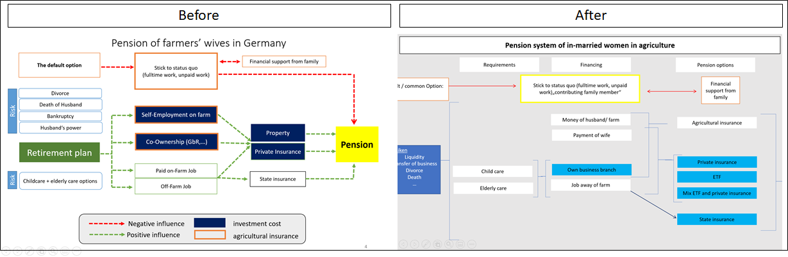

```{r setup, include=FALSE}
knitr::opts_chunk$set(echo = TRUE)
library(knitr)
library(decisionSupport)
library(readr)
library(decisionSupport)
library(DiagrammeR)
library(tidyverse)
library(ggplot2)
library(plyr)
library(dplyr)

```

```{r add_R_bib, include=FALSE}
knitr::write_bib(c(.packages(),
                   'knitr', 'decisionSupport', 'readr', 'DiagrammeR', 'tidyverse', 'ggplot2', 'plyr', 'dplyr'), 'bib/packages.bib')
```
# Abstract? 
In our project, we intend to work on gender equality in german farming.

# Introduction

The ancient role model of the male, patriarch farmer is under deconstruction [@laoire_young_2002]. When looking at agricultural study courses, practical training classes and social media, several scholars perceive a "feminization" of agriculture in Germany [@inhetveen2017feminization] - This perception is reflected in agricultural statistics, stating that women make up more than 36 % of the agricultural workers, 23% of agricultural apprentices and 48% of agricultural students [@BZL2021]. More and more innovative and successful female farmers overcome traditional role models and claim their territory in this formerly male-dominated field [@padel2020arbeiten]. 

Unfortunately, this "feminization" is not reflected in the share of leadership positions and land ownership of women. Today, only 11 % of farm managers are female and only 1/3 of land is owned by females [@destatis2020; @tietz2021untersuchung]. The main reason for this being that women have very little chance of inheriting farm land, as the old-fashioned tradition of male farm succession is still common practice [@Padel2020]. Oftentimes, the only way to gain access to land is either by starting their own farming business or by marrying into an existing one. Unfortunately, most of the latter then take on the role of the farmers wife, a contributing family member or a seasonal worker [@destatis2020]. 
The statistically important group of women who married into farms is expected to do the office-, stable- and housework (e.g.cooking,cleaning), and to take care of the children and elderly. This way they contribute to the family business without adequate financial renumeration or security [SOURCE]. When considering old age and pension, it goes without saying that this arrangement puts her at a considerable disadvantage compared to her husband. This is true for housewives in general, however, it is important to note that the agricultural pension system in Germany is unique as it is loosely based on the idea of traditional family farms.
 
Traditionally, a farmers pension was secured by keeping the family business going by passing it down to his son. However, this system is challenged by structural changes of traditional family farms (e.g.decrease in small farms) [@glauben2009probability]. Currently, the pension of farmers in Germany is usually a combination of agricultural pension insurance, leasing income from property or monthly allowance from successors[@hagedorn1991financing]. Here, the pension payment from the insurance is not intended to cover the living costs but rather simply functions as pocket money [@BMEL2021]. Therefore, revenues of leasing land during retirement is an important supplement to the agricultural pension but legally goes exclusively to the land owner (i.e. the husband in most cases). The fact that farm property rights are unequally distributed in favor of men is also reflected in the farm decision making process- 40% of farmers' wives claim that their husband decides alone on the farm [@Umfrage]. In addition, eventhough farm wives can also be insured by the agricultural insurance, they often receive a lower pension than men for various reasons (e.g. contributing family members pay and receive less pension, fewer years of contibutuin etc.)[@BREG2017]. In short, despite working full-time on the farm, farmers' wives often lack decision making power (in regards to the farm) and are financially depend on their husbands and their in-laws.
 
The imbalance of a high workload on the one hand and a lack of proper financial compensation on the other does not yield an adequate pension. Additionally, divorce or death of the husband constitute major risks for a farm wives' pension. As a result, hard-working women on family farms bear a high risk of old-age poverty if they do not have a proper pension plan. However, acquiring independent pension entitlements is challenging for women on farms. First, their „patchwork employment biographies“ are disadvantageous in the German pension system and often lead to low pension payouts. Second, patriarchal traditions demand child and elderly care from women and this workload often does not allow for noteworthy off-farm employment in the first place. Third, oftentimes farm wives are not fully aware of their situations and/or of alternatives. Breaking out of old traditions has the potential to create new opportunities and financial security and independence, but it also contains risks and uncertainties.
 
In our study, we display different pension options that farm wives have. However, given the high system complexity, the long-term benefits of pension
schemes are difficult to anticipate. This study aimed to integrate uncertainty into long-term performance projections for pension scheme interventions in Germany by applying decision analysis and probabilistic modeling approaches to produce economic ex-ante assessments for pension schemes. With our research we would like to show that risks and uncertainties do not need to be a reason to stick to a status quo that discriminates against females in farming. We would like to encourage female farmers to be courageous and look into their options and not be satisfied with practice as usual.

We compared the default option of no specific pension plan to different pension plan options. Hereby we considered the most important pension schemes relevant for women in agriculture, which is agricultural insurance, state insurance, private insurance and etfs. Furthermore, we investigated how these could be financed (e.g. own farm branch) and included possible risks (e.g.death of husband) for each finance option that would threaten the feasiblity of that pension option decision.
 
# Decision

When looking at gender equality, the freedom to act of the group that is discriminated against is usually limited and entails a number of risks. That being the case we were particularly interested to investigate the decision making process and options from the woman's point of view. In order to do that we set up a realistic and specific case study.

## Decision maker

Our decision maker is a 25 year old woman. The farm she married into is still owned by her in-laws resulting in her to be registered as a contributing family member for the next five years, until the farm is being transfered to her husband. During that time, the amount of money paid into her agricultural pension and the payout she will reveice in old age are only half of that of her husband's. At the age of 30, her husband will become farm owner and her and her husband's status will be the same in regards to the agricultural pension. It is important to keep in mind that this in not always the case. As we learned in the workshop (see section Participatory research), a large number of farms chose to cancel the woman's agricultural pension because they prefer to invest the money into the farm directly.  
There are a number of additional individual characteristics that affect her options to take precautions for her financial future. We determined her to be a gardener by trade, she did not bring any noteworthy wealth or property into the marriage and the couple already has one child.

TABLE? OVERVIEW?
 
## Options

She has two options to chose from.

Decision option 1 aka Default option: 
The first option is to stick to the status quo, meaning she follows the traditional structures (i.e. contributing full time to the family business without renumeration) ,and relies on her husband and his farming business to secure her pension. In this case she is officially registered as a farm wife and the mandatory agricultural insurance is paid for her by her husband.
 
Decision option 2
As an alternative option, she pursues a pension plan to ensure financial security once she retires. There is a considerable amount of different pension schemes to chose from along with a number of possible ways to finance her pension independently of her husband (e.g. off-farm employment). Additionally, each option comes with its' own risks.

## Stakeholders 

There are four stakeholders in this decision. 

### Farmer
### Children
### Young female farmers
### Students with a partner with a farm

# Methods
After extensive literature research on female farmers in Germany, we identified the statistically important group of women married into farms and narrowed down the focus on the pension issue for these women in Germany. In order to illustrate possible options and interrelations that help to facilitate a decision making process, we created a first draft of a conceptual model (see Figure 1). Next, we took the participatory approach and reached out to stakeholders and experts to update our model. We then used the updated version (see Figure 4) as a template for our coded model. 

## Draft of conceptual model
 drafting a first model based on literature (WEBSITES USED TO GET THIS INFORMATION?) and personal experiences
 
 PICTURE FIGURE 1 : MODEL BEFORE WORKSHOP

## Participatory approach 

In this step, our goal was to gain a better understanding of the actual and current pension situation of farmers wives' in Germany, to define a realistic case of a decision maker and to update and adjust our initial conceptual model. For this, we first identified advisors in insurance companies such as WHICH ONES?, the agricultural chamber (i.e. Landwirtschaftskammer Nordrhein-Westfalen), and the german woman farmers association (i.e. deutscher Landfrauenverband) as our experts and conducted several interviews via phone and the video communiactions platform zoom.us. Additionally, we used the social networking sites facebook.com and instagram.com to approach potential decision makers. We then organised an online workshop over zoom with the previously identified experts, stakeholders and potential decision makers (Figure 2). Figure 3 shows an overview of the participants, their status in our research, and whether they partook in an interview and/or in the workshop.
In total, 15 participants attended our workshop. After a brief introduction and a general initial discussion, the participants were given three questions, namely "What pension options does a farm wife have?" "What are potential risks and obstacles?" and "How could she finance the pension options?". After answering these questions in groups of three, we collected all thoughts and ideas in plenum. After a lively discussion we were able to update our model.


```{r, echo=FALSE, out.width='50%', fig.align='center', fig.cap='Invitation to the Workshop', fig.show='hold'}
knitr::include_graphics('images/1.png')
knitr::include_graphics('images/2.png')
```
FIGURE 2


|  Participant 	| Status  	|  Interview 	|  Workshop participation 	|   	|
|---	|---	|---	|---	|---	|
|  Farmer's wife 	|  decision-maker 	|   no	|  yes 	|   	|
|  Farmer 	|  stakeholder and co-decision-maker 	|   no	|  no 	|   	|
|  Farm Children 	|  stakeholder 	|  no 	|  yes 	|   	|
|  Rural woman association 	|  expert 	|  yes 	|  yes 	|   	|
|  Agricultural Insurance agency 	|  expert 	|  yes 	|   yes	|   	|
|  State insurance agency 	|  expert 	|   no	|  no 	|   	|
|  Private insurance consultant 	|  expert 	|  yes 	|   no	|   	|
|  Agriculral chamber consultant 	|  expert 	|  yes 	|   yes	|   	|
|  Lawyer for agricultural family law	|  expert 	|  no 	| yes  	|   	|
|  Young woman farmers	|  stakeholder 	|   no	|  yes 	|   	|
|  Students with a partner with farm 	|  stakeholder 	|   no	| no  	|   	|

FIGURE 3

## Adjustment of conceptual model

(Some options are only possible with specific financing decisions: e.g. state retirement is only possible when woman has a formal working contract with her husband or another employer. )

We worked together with experts to derive a conceptual model that explicitly identified all the important factors
and relationships in pension schemes for in-married woman in Agriculture. Since the pension yield and input demand depend
on the age of the decision-maker, all benefits and costs were modeled in relation to the age of the decision maker. Since the monthly
input costs varied throughout the employment biography, reasonable time intervals were specified. Risks were quantified in the
model by simulating the likelihood and consequences of events perceived as consequential for pension entitlement of woman.

out time unit is month, therefore, all code applies to month

The model was created with the @R-decisionSupport. We made use of the tools of the @R-tidyverse. 
This report was compiled using tools from the @R-knitr team.

It is important to note, that our model acknowledges the contemporary legal constraints in Germany. we explicitly follow the available information on German Pension schemes as stated by pension consultants and expansionists.

```{r model, echo=FALSE, fig.cap='Model'}


library(DiagrammeR)

mermaid("graph LR
        
        D(No specific pension plan AKA Business as usual) --> SQ(Contributing Family member);
        SQ              --> Fam(Financial support from family);
        
        PP(Pension Plan)--> FM(Money from Husband);
        PP              --> FJ(payed on farm job);
        PP              --> OB(Own Business branch);
        PP              --> OJ(Off-Farm job);
        
        FM(Money from Husband) -->AI(Agricultural insurance);
        FJ(payed on farm job)  -->SI(State insurance);
        OB(Own Business branch)-->AI(Agricultural insurance);
        OJ(Off-Farm job)       -->SI(State insurance);
        SQ                     -->AI
        FM(Money from Husband) -->PI(Private insurance);
        FJ(payed on farm job)  -->PI(Private insurance);
        OB(Own Business branch)-->PI(Private insurance);
        OJ(Off-Farm job)       -->PI(Private insurance);
        
        PI      --> P(Pension);
        SI      --> P;
        AI      --> p
        ")
        

```

This plot was created with @R-DiagrammeR.


```{r, echo=FALSE, out.width='100%', fig.align='center', fig.cap='Model before and after', fig.show='hold'}

```


## Model Inputs

After receiving a calibration training in the DA-Course, we considered ourselves calibrated experts. For our input table, we estimated reasonable ranges based on a mixed approach of literature research and expert opinion. According to the Methodology of @do_decision_2020, we tried to assign reasonable uncertainties given the long time horizon of our model.

```{r tables, echo=FALSE}
input_table_gender <-read.csv2("./input_table_gender_4th.csv", dec = ",")
knitr::kable(input_table_gender, caption = 'Input table')
# [1:5, ]
```

# Coding the model

# Results/Outcome

# Discussion

## Problems/Obstacles/Uncertainties/what we did not implemement

There are severalrisks, that would even decrease the value of the default option. 
Risk of no farm transfer: when the farm actually does not belong to the partner, but still to the parents in law, the situation of the woman is very insecure. She will not be registered as a wife. Without marriage, she can not be registered as a contributing family member. 

Case of no marriage: When the woman is not married but "only" a partner, she will mot be eligible to the agricultural pension.

## Stakeholders positions and policy implications
- Landfrauen: have a position paper in which they demand a state insurance, 
which is independent from the money / years payed in. They claim that womans patchwork employment biographies are penalized in the current system and the individual woman can barely overcome this imbalance with her own decisions. 

# Conclusion

# References


 Identification of research priorities and model sketch
 
In our project, we intended to work on gender equality in German farming.

After extensive literature research on woman farmers in Germany, we identified the statistically important group of in-married woman and narrowed our research question down to the pension of in-married woman in Germany.

Decision option 1 aka Default option: 
Woman has an apprenticeship as a gardener, marries a farmer and starts working full time on farm. She is officially registered as a farm wife 
and therefore pays in the agricultural insurance. 

Decision option 2
The Woman pursues a pension plan to ensure financial security once she retires. Here, different sub-option are outlined. 
There are different options to finance the pension contrivutions and also different pension schemes to choose from. Some options are only possible with specific financing decisions: e.g. state retirement is only possible when woman has a formal working contract with her husband or another employer. 

It is important to note, that our model acknowledges the contemporary legal constraints in Germany. we explicitly follow the available information on German Pension schemes as stated by pension consultants and expansionists.

```{r model, echo=FALSE, fig.cap='Model'}


library(DiagrammeR)

mermaid("graph LR
        
        D(No specific pension plan AKA Business as usual) --> SQ(Contributing Family member);
        SQ              --> Fam(Financial support from family);
        
        PP(Pension Plan)--> FM(Money from Husband);
        PP              --> FJ(payed on farm job);
        PP              --> OB(Own Business branch);
        PP              --> OJ(Off-Farm job);
        
        FM(Money from Husband) -->AI(Agricultural insurance);
        FJ(payed on farm job)  -->SI(State insurance);
        OB(Own Business branch)-->AI(Agricultural insurance);
        OJ(Off-Farm job)       -->SI(State insurance);
        SQ                     -->AI
        FM(Money from Husband) -->PI(Private insurance);
        FJ(payed on farm job)  -->PI(Private insurance);
        OB(Own Business branch)-->PI(Private insurance);
        OJ(Off-Farm job)       -->PI(Private insurance);
        
        PI      --> P(Pension);
        SI      --> P;
        AI      --> p
        ")
        

```

This plot was created with @R-DiagrammeR.

Participatory approach

Corresponding to our Research question, we identified experts in insurance companies, the agricultural chamber, the woman farmers association as our experts. In an online community of woman in agriculture, we approached potential decision makers.  After drafting a first model based on literature research and personal experiences, we contacted the experts and conducted several one-to one Interviews. The insights from with equal pay consultants and the insurance company were valuable for our system understanding. In a next step, we organized an online workshop with potential decision makers and experts. and a lively group discussion. After a lively discussion discussion with experts and decision makers, we updated our model and used the updated version for further analysis.

|  Position 	| Type  	|  Interview 	|  Workshop participation 	|   	|
|---	|---	|---	|---	|---	|
|  Farmer's wife 	|  decision-maker 	|   no	|  yes 	|   	|
|  Farmer 	|  stakeholder and co-decision-maker 	|   no	|  no 	|   	|
|  Farm Children 	|  stakeholder 	|  no 	|  no 	|   	|
|  Rural woman association 	|  expert 	|  yes 	|  yes 	|   	|
|  Agricultural Insurance agency 	|  expert 	|  yes 	|   yes	|   	|
|  State insurance agency 	|  expert 	|   no	|  no 	|   	|
|  Private insurance consultant 	|  expert 	|  yes 	|   no	|   	|
|  Agriculral chamber consultant 	|  expert 	|  yes 	|   yes	|   	|
|  Lawyer for agricultural family law	|  expert 	|  no 	| yes  	|   	|
|  Young woman farmers	|  stakeholder 	|   no	|  yes 	|   	|
|  Students with a partner with farm 	|  stakeholder 	|   no	| no  	|   	|


```{r, echo=FALSE, out.width='50%', fig.align='center', fig.cap='Invitation to the Workshop', fig.show='hold'}
knitr::include_graphics('images/1.png')
knitr::include_graphics('images/2.png')
```

```{r, echo=FALSE, out.width='100%', fig.align='center', fig.cap='Model before and after', fig.show='hold'}

```


 Model Inputs 

After receiving a calibration training in the DA-Course, we considered ourselves calibrated experts. For our input table, we estimated reasonable ranges based on a mixed approach of literature research and expert opinion. According to the Methodology of @do_decision_2020, we tried to assign reasonable uncertainties given the long time horizon of our model.

```{r tables, echo=FALSE}
input_table_gender <-read.csv2("./input_table_gender_4th.csv", dec = ",")
knitr::kable(input_table_gender, caption = 'Input table')
# [1:5, ]
```

 Model inmpementation and specification 
 
We worked together with experts to derive a conceptual model that explicitly identified all the important factors
and relationships in pension schemes for in-married woman in Agriculture. Since the pension yield and input demand depend
on the age of the decision-maker, all benefits and costs were modeled in relation to the age of the decision maker. Since the monthly
input costs varied throughout the employment biography, reasonable time intervals were specified. Risks were quantified in the
model by simulating the likelihood and consequences of events perceived as consequential for pension entitlement of woman.

out time unit is month, therefore, all code applies to month

The model was created with the @R-decisionSupport. We made use of the tools of the @R-tidyverse. 
This report was compiled using tools from the @R-knitr team.

# Results
Long-term payments directed to their woman retirement incur high establishment and maintenance costs and will generate net losses in the first few years but return substantial benefits to the wife and family in the long term. 


# Discussion
Annual profits from farming mostly benefit the farm owner, which is often not the woman. Farmers likely prefer reinvesting the available money in farming technology due to the relatively early incomes and short time-lag on returns. However, structural changes in agriculture and the high give-up rates impose high insecurity on the future of the farm and may raise the awareness for proper pension plans.
 Uncertainties related to the communication culture in farming families, farmers’ values, farm profitability, and pension returns appeared to have the greatest influence on whether a retirement plan emerged as the preferable option. Better access to information and self confidence to ask for a fair share of farming income are prerequisites to implement pension plans for in-married woman in German farms. Narrowing these key knowledge gaps may offer additional clarity on farmers’ wives optimal course of action and provide guidance for agencies promoting insurance interventions in Germany. Our model produced a set of plausible ranges for net present values and highlighted critical variables, more clarity on which would support decision-making under uncertainty. Our research approach proved effective in providing forecasts of uncertain outcomes and can be useful for informing family farms pursuing a pension plan.
 
@do_decision_2020
@fabian2018stellung
@muller2010kostenlosen
@hadler2020
@oedl2020feminist_innen
@BREG2017

 What we did not implement. 
There are severalrisks, that would even decrease the value of the default option. 
Risk of no farm transfer: when the farm actually does not belong to the partner, but still to the parents in law, the situation of the woman is very insecure. She will not be registered as a wife. Without marriage, she can not be registered as a contributing family member. 

Case of no marriage: When the woman is not married but "only" a partner, she will mot be eligible to the agricultural pension. 

 Stakeholders positions and policy implications
- Landfrauen: have a position paper in which they demand a state insurance, 
which is independent from the money / years payed in. They claim that womans patchwork employment biographies are penalized in the current system and the individual woman can barely overcome this imbalance with her own decisions. 


 Conclusion
This is our conclusion

 References

